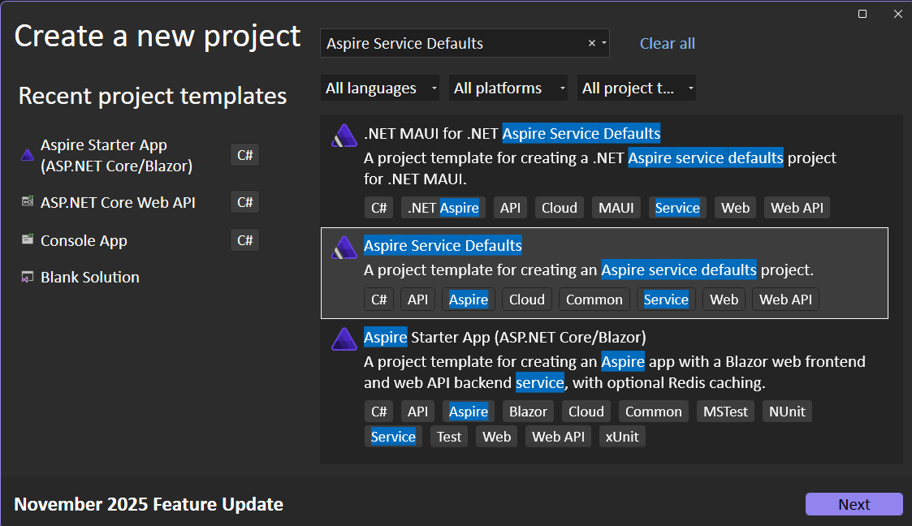
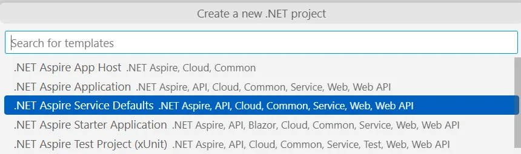
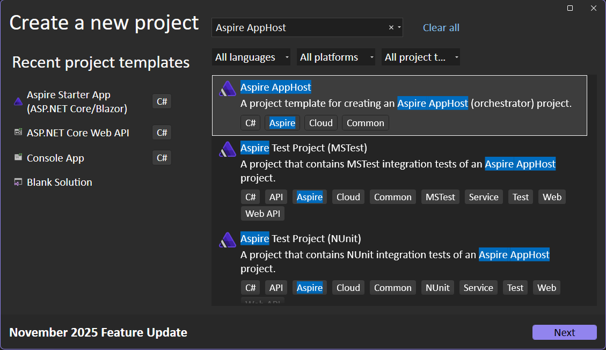
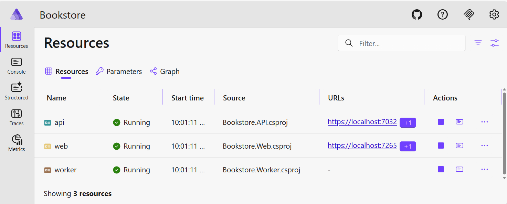
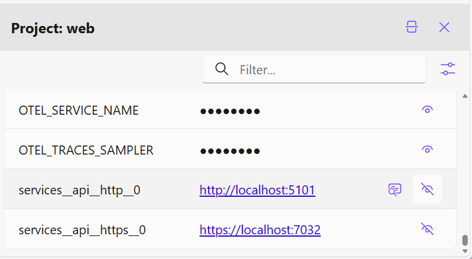

# Lesson 1: Getting Started with .NET Aspire

## Introduction

In this lesson, you'll learn how to add .NET Aspire to an existing Bookstore application. Aspire provides powerful capabilities for building cloud-native, distributed applications including:

- **Service Defaults**: Smart defaults for telemetry, resiliency, health checks, and service discovery
- **Orchestration**: App Host project to manage and run multiple services together
- **Dashboard**: Built-in developer dashboard for monitoring logs, traces, metrics, and more
- **Service Discovery**: Automatic service-to-service communication without hardcoded URLs
- **Integrations**: Easy integration with databases, caching, messaging, and other services

By the end of this lesson, you'll have transformed a plain .NET solution into an Aspire-powered application with a Bookstore API, a Blazor Web frontend, and an Admin application.

## Prerequisites

- .NET 10 SDK installed
- Visual Studio 2022 or Visual Studio Code with C# Dev Kit
- Basic understanding of ASP.NET Core and Blazor

## Starting Point

The `/start` folder contains a basic Bookstore application with:
- [`Bookstore.API`](../../start/Bookstore.API/Program.cs) - A Minimal API serving book data
- [`Bookstore.Web`](../../start/Bookstore.Web/Bookstore.Web/Program.cs) - A Blazor Web App displaying books
- [`Bookstore.Shared`](../../start/Bookstore.Shared/Models.cs) - Shared models (Book, Order)

Currently, the Web app connects to the API using a hardcoded URL (`https://localhost:7032`). We'll improve this with Aspire!

---

## Part A: Add Service Defaults Project

Service Defaults provide a centralized place to configure common cross-cutting concerns like telemetry, health checks, and resiliency for all services in your application.

### What are Service Defaults?

Aspire's Service Defaults automatically configure:
- **Telemetry**: OpenTelemetry for metrics, tracing, and logging
- **Resiliency**: Polly policies for HTTP retries and circuit breakers
- **Health Checks**: Endpoints for monitoring service health (`/health`, `/alive`)
- **Service Discovery**: Configuration-based endpoint resolution

### Create the ServiceDefaults Project

#### Visual Studio & Visual Studio Code

1. Add a new project to the solution called [`Bookstore.ServiceDefaults`](./code/Bookstore.ServiceDefaults/Bookstore.ServiceDefaults.csproj):
   - Right-click on the solution and select `Add` > `New Project`
   - Select the **Aspire Service Defaults** project template
   - Name the project `Bookstore.ServiceDefaults`
   - Click `Next` > `Create`



In VS Code it looks like this:



#### Command Line

1. Create a new project using the `dotnet new aspire-servicedefaults` command:

```bash
dotnet new aspire-servicedefaults -n Bookstore.ServiceDefaults -o start/Bookstore.ServiceDefaults
```

2. Add the new ServiceDefaults project to your solution:

```bash
dotnet sln start/Bookstore.sln add start/Bookstore.ServiceDefaults/Bookstore.ServiceDefaults.csproj
```

### Configure Projects to Use Service Defaults

Now we need to add references to the ServiceDefaults project and call its extension methods in both the API and Web projects.

**Why these steps?**
- Adding project references allows the API and Web projects to consume the shared configuration
- Calling `builder.AddServiceDefaults()` applies the opinionated smart defaults (telemetry, health checks, service discovery, resilient HTTP)
- Calling `app.MapDefaultEndpoints()` maps health endpoints (`/health`, `/alive`) for diagnostics and readiness probes

#### 1. Add ServiceDefaults Reference to API Project

**Visual Studio/VS Code**: Right-click on the [`Bookstore.API`](../../start/Bookstore.API/Bookstore.API.csproj) project → `Add` > `Reference` → Check `Bookstore.ServiceDefaults` → Click `OK`

**Command Line**:
```bash
dotnet add start/Bookstore.API/Bookstore.API.csproj reference start/Bookstore.ServiceDefaults/Bookstore.ServiceDefaults.csproj
```

#### 2. Update API Program.cs

Open [`Bookstore.API/Program.cs`](../../start/Bookstore.API/Program.cs) and add the following:

Add `builder.AddServiceDefaults();` immediately after `var builder = WebApplication.CreateBuilder(args);`:

```csharp
using Bookstore.Shared;
using Microsoft.AspNetCore.Mvc;

var builder = WebApplication.CreateBuilder(args);

builder.AddServiceDefaults();  // Add this line

builder.Services.AddOpenApi();

var app = builder.Build();

app.MapDefaultEndpoints();  // Add this line

if (app.Environment.IsDevelopment())
{
    app.MapOpenApi();
}

// Rest of the code...
```

#### 3. Add ServiceDefaults Reference to Web Project

**Visual Studio/VS Code**: Right-click on the [`Bookstore.Web`](../../start/Bookstore.Web/Bookstore.Web/Bookstore.Web.csproj) project → `Add` > `Reference` → Check `Bookstore.ServiceDefaults` → Click `OK`

**Command Line**:
```bash
dotnet add start/Bookstore.Web/Bookstore.Web/Bookstore.Web.csproj reference start/Bookstore.ServiceDefaults/Bookstore.ServiceDefaults.csproj
```

#### 4. Update Web Program.cs

Open [`Bookstore.Web/Bookstore.Web/Program.cs`](../../start/Bookstore.Web/Bookstore.Web/Program.cs) and add the following:

Add `builder.AddServiceDefaults();` immediately after `var builder = WebApplication.CreateBuilder(args);`:

```csharp
using Bookstore.Web.Client.Pages;
using Bookstore.Web.Components;
using Bookstore.Web.Clients;

var builder = WebApplication.CreateBuilder(args);

builder.AddServiceDefaults();  // Add this line

builder.Services.AddHttpClient<BookstoreClient>(client =>
{
    client.BaseAddress = new("https://localhost:7032");
});

// Add services to the container.
builder.Services.AddRazorComponents()
    .AddInteractiveServerComponents()
    .AddInteractiveWebAssemblyComponents();

var app = builder.Build();

app.MapDefaultEndpoints();  // Add this line

// Rest of the code...
```

### Verify Service Defaults

Build the solution to ensure everything compiles:

```bash
dotnet build start/Bookstore.sln
```

You can now run both projects and test the health endpoints:
- API: `https://localhost:7032/health`
- Web: `https://localhost:7274/health`

You should see output like `Healthy` indicating the health checks are working!

---

## Part B: Add App Host Project

The App Host project orchestrates your services, making it easy to run multiple projects together and providing the Aspire Dashboard for monitoring.

### What is the App Host?

The App Host (also called Orchestrator) is a .NET project that:
- Defines your application model (which services, containers, and resources exist)
- Starts and manages all services together
- Provides the Aspire Dashboard at development time
- Configures service-to-service communication

### Create the AppHost Project

#### Visual Studio & Visual Studio Code

1. Add a new project to the solution called [`Bookstore.AppHost`](./code/Bookstore.AppHost/Bookstore.AppHost.csproj):
   - Right-click on the solution and select `Add` > `New Project`
   - Select the **Aspire App Host** project template
   - Name the project `Bookstore.AppHost`
   - Click `Next` > `Create`



#### Command Line

1. Create a new project using the `dotnet new aspire-apphost` command:

```bash
dotnet new aspire-apphost -n Bookstore.AppHost -o start/Bookstore.AppHost
```

2. Add the new AppHost project to your solution:

```bash
dotnet sln start/Bookstore.sln add start/Bookstore.AppHost/Bookstore.AppHost.csproj
```

### Add Project References

The AppHost needs references to the projects it will orchestrate.

#### Visual Studio/VS Code

Right-click on the [`Bookstore.AppHost`](./code/Bookstore.AppHost/Bookstore.AppHost.csproj) project → `Add` > `Reference` → Check both `Bookstore.API` and `Bookstore.Web` → Click `OK`

> **Pro Tip**: In Visual Studio 2022, you can drag and drop projects onto the AppHost project to add references.

#### Command Line

```bash
dotnet add start/Bookstore.AppHost/Bookstore.AppHost.csproj reference start/Bookstore.API/Bookstore.API.csproj
dotnet add start/Bookstore.AppHost/Bookstore.AppHost.csproj reference start/Bookstore.Web/Bookstore.Web/Bookstore.Web.csproj
```

When these references are added, helper classes are automatically generated to help add them to the app model.

### Orchestrate the Application

Open [`Bookstore.AppHost/Program.cs`](./code/Bookstore.AppHost/Program.cs) and add your projects to the app model:

```csharp
var builder = DistributedApplication.CreateBuilder(args);

var api = builder.AddProject<Projects.Bookstore_API>("api");

var web = builder.AddProject<Projects.Bookstore_Web>("web");

var worker = builder.AddProject<Projects.Bookstore_Worker>("worker");

builder.Build().Run();
```

> **Note**: The project names use underscores (`Bookstore_API`, `Bookstore_Web`) instead of dots because they're generated as C# identifiers.

### Run the Application

#### Set AppHost as Startup Project

**Visual Studio**: Right-click the [`Bookstore.AppHost`](./code/Bookstore.AppHost/Bookstore.AppHost.csproj) project → `Set as Startup Project`

**Visual Studio Code**: Create or update `.vscode/launch.json`:

```json
{
  "version": "0.2.0",
  "configurations": [
    {
      "name": "Run AppHost",
      "type": "dotnet",
      "request": "launch",
      "projectPath": "${workspaceFolder}/start/Bookstore.AppHost/Bookstore.AppHost.csproj"
    }
  ]
}
```

#### Launch the Dashboard

Press `F5` or click `Start Debugging`. The **Aspire Dashboard** will open in your browser!
OR use the CLI with the command `aspire run`



The dashboard shows:
- **Resources**: All running services (api, web)
- **Console Logs**: Real-time logs from each service
- **Traces**: Distributed tracing across services
- **Metrics**: Performance metrics
- **Structured Logs**: Filterable log entries

#### Explore the Dashboard

1. **View Endpoints**: Click on the endpoint for the `web` project (usually `https://localhost:7274`) to open the Bookstore website
2. **View Logs**: Click `View Logs` for any resource to see console output
3. **View Traces**: Navigate to the `Traces` tab, then click `View` on a trace to see the request flow
4. **View Metrics**: Explore the `Metrics` tab to see HTTP request duration, request rates, and more

---

## Part C: Configure Service Discovery

Currently, the Web app still uses a hardcoded URL to connect to the API. Let's use Aspire's service discovery to make this dynamic!

### What is Service Discovery?

Service discovery allows services to reference each other by name (e.g., `api`) instead of hardcoded URLs. Aspire automatically:
- Resolves service names to actual endpoints at runtime
- Handles multiple endpoints (http/https)
- Works in development and production environments
- Updates configuration automatically when services move

### Update AppHost to Enable Service Discovery

Open [`Bookstore.AppHost/Program.cs`](./code/Bookstore.AppHost/Program.cs) and update it to add a reference from web to api:

```csharp
var builder = DistributedApplication.CreateBuilder(args);

var api = builder.AddProject<Projects.Bookstore_API>("api");

var web = builder.AddProject<Projects.Bookstore_Web>("web")
    .WithReference(api)                  // Enable service discovery
    .WithExternalHttpEndpoints();        // Allow external access

builder.AddProject<Projects.Bookstore_Worker>("worker")
    .WithReference(api);

builder.Build().Run();
```

**What does this do?**
- `WithReference(api)`: Injects configuration into the Web project so it can discover the API by name
- `WithExternalHttpEndpoints()`: Makes the web service accessible from outside (needed for deployment)

### Update Web App to Use Service Discovery

Service discovery in Aspire works through configuration. The AppHost injects settings like `services__api__http__0` and `services__api__https__0` into the Web project.

#### Option 1: Update the HttpClient BaseAddress

Open [`Bookstore.Web/Bookstore.Web/Program.cs`](../../start/Bookstore.Web/Bookstore.Web/Program.cs) and change the hardcoded URL to use service discovery:

```csharp
builder.Services.AddHttpClient<BookstoreClient>(client =>
{
    client.BaseAddress = new("https+http://api");  // Changed from https://localhost:7032
});
```

**About `https+http://api`:**
- The scheme `https+http` tells the resolver to prefer HTTPS if available, otherwise fall back to HTTP
- `api` is the name we gave the API project in the AppHost
- Multiple schemes are evaluated left-to-right, separated by `+`
- This works for local development (HTTP only) and production (HTTPS) without changes

> **Important**: Only use multi-scheme URIs for internal service-to-service communication. Don't expose them in user-facing URLs.

#### Option 2: Use Configuration (Alternative)

Alternatively, you can use the existing configuration approach. Create or update [`appsettings.json`](../../start/Bookstore.Web/Bookstore.Web/appsettings.json):

```json
{
  "BookstoreApiUrl": "https+http://api"
}
```

Then update [`Program.cs`](../../start/Bookstore.Web/Bookstore.Web/Program.cs):

```csharp
builder.Services.AddHttpClient<BookstoreClient>(client =>
{
    var apiUrl = builder.Configuration["BookstoreApiUrl"] ?? "https://localhost:7032";
    client.BaseAddress = new(apiUrl);
});
```

Do the same for the worker project

### Test Service Discovery

1. Run the AppHost (`F5`)
2. Open the Aspire Dashboard
3. Click on the `web` project's Details
4. Click the eye icon to reveal configuration values
5. Scroll to see `services__api__http__0` and `services__api__https__0` with the API's actual URLs



6. Open the web endpoint and verify the bookstore still works!

The Web app is now discovering the API automatically. If you change the API's port, it will still work without code changes!

---

## Part D: Adding the Admin React Application

Now let's add a JavaScript-based React application to our Aspire orchestration. The Admin app provides a web interface for managing books and viewing orders.

### What is the Admin App?

The Admin app is a React application built with Vite that allows administrators to:
- View and manage the book inventory
- Add new books to the catalog
- Delete books from the inventory
- View customer orders

### Why AddJavaScriptApp?

Aspire provides [`AddJavaScriptApp()`](https://learn.microsoft.com/dotnet/aspire/get-started/build-aspire-apps-with-nodejs) specifically for orchestrating JavaScript/Node.js applications. This method:
- Works with any Node.js application (React, Vue, Angular, Express, etc.)
- Automatically configures environment variables for service discovery
- Handles lifecycle management (start/stop)
- Integrates with the Aspire Dashboard for monitoring
- Supports containerization for deployment

> **Note**: [`AddJavaScriptApp()`](https://learn.microsoft.com/dotnet/aspire/get-started/build-aspire-apps-with-nodejs) is different from `AddNpmApp()`. Use [`AddJavaScriptApp()`](https://learn.microsoft.com/dotnet/aspire/get-started/build-aspire-apps-with-nodejs) when you want to run the built application, while `AddNpmApp()` is for running npm scripts during development.

### Prerequisites

Before adding the Admin app, ensure you have:
- **Node.js** installed (v18 or higher recommended)
- **npm** package manager
- The [`Bookstore.Admin`](../../start/Bookstore.Admin) folder in your project

### Step 1: Add the Aspire JavaScript Hosting Package

The AppHost needs a NuGet package to support JavaScript applications.

**Command Line**:
```bash
dotnet add start/Bookstore.AppHost/Bookstore.AppHost.csproj package Aspire.Hosting.JavaScript --version 13.1.0
```

**Visual Studio/VS Code**:
- Right-click on [`Bookstore.AppHost`](./code/Bookstore.AppHost/Bookstore.AppHost.csproj) project → `Manage NuGet Packages`
- Search for `Aspire.Hosting.JavaScript`
- Install version `13.1.0`

### Step 2: Update AppHost to Add the Admin App

Open [`Bookstore.AppHost/Program.cs`](./code/Bookstore.AppHost/Program.cs) and add the Admin app:

```csharp
var builder = DistributedApplication.CreateBuilder(args);

var api = builder.AddProject<Projects.Bookstore_API>("api");

var web = builder.AddProject<Projects.Bookstore_Web>("web")
    .WithReference(api)
    .WithExternalHttpEndpoints();

// Add Admin React app
var admin = builder.AddJavaScriptApp("admin", "../Bookstore.Admin")
    .WithReference(api)
    .WithHttpEndpoint(env: "PORT")
    .WithExternalHttpEndpoints()
    .PublishAsDockerFile();

builder.Build().Run();
```

### Understanding Each Method

Let's break down what each method does:

#### `AddJavaScriptApp("admin", "../Bookstore.Admin")`
- Registers a Node.js/JavaScript application with Aspire
- `"admin"` is the resource name shown in the dashboard
- `"../Bookstore.Admin"` is the relative path to the Node.js project directory
- Aspire will run `npm run dev` (or the configured script) to start the app

#### `WithReference(api)`
- Enables service discovery from the Admin app to the API
- Injects environment variables like `services__api__http__0` and `services__api__https__0`
- The Admin app can use these to dynamically discover the API URL
- No hardcoded URLs needed!

#### `WithHttpEndpoint(env: "PORT")`
- Configures an HTTP endpoint for the Admin app
- `env: "PORT"` tells Aspire to pass the port number via the `PORT` environment variable
- Vite and most Node.js frameworks read this variable automatically
- Aspire assigns a dynamic port to avoid conflicts

#### `WithExternalHttpEndpoints()`
- Makes the Admin app accessible from outside the local machine
- Required for deployment scenarios (Azure Container Apps, Kubernetes, etc.)
- Without this, the endpoint would only be accessible within the Aspire network

#### `PublishAsDockerFile()`
- Generates a Dockerfile for the Admin app during deployment
- Enables containerized deployment without manually writing Dockerfiles
- The container will run `npm run build` and serve the production build
- Optional for local development, but important for deployment

### Step 3: Configure the Admin App to Use Service Discovery

The Admin app currently has a hardcoded API URL. Let's make it dynamic!

Open [`Bookstore.Admin/src/App.jsx`](../../start/Bookstore.Admin/src/App.jsx) and update line 4:

**Before:**
```javascript
const API_BASE_URL = 'https://localhost:7032'
```

**After:**
```javascript
// Use environment variable for API URL (provided by Aspire service discovery)
const API_BASE_URL = import.meta.env.VITE_services__api__https__0 ||
                     import.meta.env.VITE_services__api__http__0 ||
                     'https://localhost:7032'
```

**How this works:**
- Aspire injects service discovery variables like `services__api__https__0`
- Vite exposes environment variables with the `VITE_` prefix
- The code tries HTTPS first, falls back to HTTP, then to the hardcoded URL
- This works seamlessly in development and production!

### Step 4: Run and Verify

Now let's test the Admin app integration!

1. **Start the AppHost** (Press `F5` or run `dotnet run --project start/Bookstore.AppHost`)

2. **Open the Aspire Dashboard** (usually opens automatically at `http://localhost:15888` or similar)

3. **Verify Admin appears** in the Resources tab:
   - You should see a resource named `admin`
   - Status should show `Running`
   - An endpoint URL will be displayed (e.g., `http://localhost:5174`)

4. **View Admin Logs**:
   - Click `View Logs` for the `admin` resource
   - You should see Vite's development server output
   - Look for messages like "Local: http://localhost:5174"

5. **Access the Admin UI**:
   - Click the endpoint link for the `admin` resource
   - The Admin UI should load in your browser
   - You should see the "Bookstore Admin Panel" with tabs for Books, Add Book, and Orders

6. **Test API Communication**:
   - Click the "Books" tab
   - The Admin app should fetch and display books from the API
   - If you see books listed, service discovery is working! 🎉

### Complete AppHost Example

Here's what your complete [`Program.cs`](./code/Bookstore.AppHost/Program.cs) should look like after adding all parts (A through D):

```csharp
var builder = DistributedApplication.CreateBuilder(args);

// Part A & B: Add API project with service defaults
var api = builder.AddProject<Projects.Bookstore_API>("api");

// Part C: Add Web project with service discovery
var web = builder.AddProject<Projects.Bookstore_Web>("web")
    .WithReference(api)
    .WithExternalHttpEndpoints();

// Part D: Add Admin React app
var admin = builder.AddJavaScriptApp("admin", "../Bookstore.Admin")
    .WithReference(api)
    .WithHttpEndpoint(env: "PORT")
    .WithExternalHttpEndpoints()
    .PublishAsDockerFile();

// Add Worker service
builder.AddProject<Projects.Bookstore_Worker>("worker")
    .WithReference(api);

builder.Build().Run();
```

### Benefits of Orchestrating JavaScript Apps with Aspire

#### 1. **Unified Developer Experience**
- Manage all services (.NET and JavaScript) from a single dashboard
- Start/stop everything with one command
- Consistent monitoring and logging across all technologies

#### 2. **Service Discovery**
- JavaScript apps can discover .NET services by name
- No environment-specific configuration files
- Works the same in development, staging, and production

#### 3. **Automatic Configuration**
- Aspire injects connection strings and service URLs automatically
- No manual configuration needed
- Environment variables are managed for you

#### 4. **Deployment Ready**
- `PublishAsDockerFile()` generates production-ready containers
- Deploy to Azure Container Apps, Kubernetes, or Docker
- No manual Dockerfile creation needed

#### 5. **Observability**
- All JavaScript app logs appear in the Aspire Dashboard
- Monitor performance and errors alongside .NET services
- Integrated tracing across service boundaries

### How Service Discovery Works in JavaScript Apps

When you use `WithReference(api)` in the AppHost, Aspire:

1. **Injects environment variables** into the Admin app:
   ```
   services__api__http__0=http://localhost:5123
   services__api__https__0=https://localhost:7032
   ```

2. **The JavaScript app reads these variables** using Vite's `import.meta.env`:
   ```javascript
   const apiUrl = import.meta.env.VITE_services__api__https__0
   ```

3. **HTTP requests use the discovered URL**:
   ```javascript
   fetch(`${apiUrl}/books`)
   ```

4. **Aspire updates the URLs automatically** when services move or ports change

This approach works with any JavaScript framework (React, Vue, Angular, Next.js, Express, etc.)!

### Differences: AddJavaScriptApp vs AddNpmApp

| Feature | AddJavaScriptApp | AddNpmApp |
|---------|------------------|-----------|
| **Use Case** | Run built/compiled apps | Run npm scripts (dev mode) |
| **Typical Command** | `node dist/index.js` | `npm run dev` |
| **Best For** | Production-like setup | Active development |
| **Hot Reload** | ❌ | ✅ (if supported by tool) |
| **Build Required** | ✅ | ❌ |
| **Deployment** | ✅ Better suited | ❌ Not recommended |

For this workshop, we use [`AddJavaScriptApp()`](https://learn.microsoft.com/dotnet/aspire/get-started/build-aspire-apps-with-nodejs) because it works well for both development and deployment scenarios.

### Troubleshooting

**Admin app not starting?**
- Ensure `npm install` was run in the `Bookstore.Admin` directory
- Check the Admin logs in the Aspire Dashboard for errors
- Verify Node.js is installed: `node --version`

**Can't connect to API?**
- Check that the API resource is running in the dashboard
- Verify the service discovery environment variables are injected (click Details on the admin resource)
- Look for `VITE_services__api__http__0` or similar variables

**Port conflicts?**
- Aspire automatically assigns dynamic ports
- If you have a conflict, Aspire will choose a different port
- Check the actual endpoint in the dashboard

---

## Understanding the Dashboard

The Aspire Dashboard is a powerful tool for local development. Let's explore its features:

### Resources Tab

Shows all services, containers, and projects:
- **Status**: Running, Stopped, or Failed
- **Endpoints**: Click to open in browser
- **Actions**: View Logs, Details, Restart, Stop

### Console Logs

Real-time streaming logs from all resources. Features:
- Filter by resource
- Search within logs
- Text wrapping toggle
- Export logs

### Structured Logs

Filterable, queryable logs with:
- Log level filtering (Error, Warning, Info, Debug)
- Time range selection
- Full-text search
- Trace ID linking

### Traces

Distributed tracing shows:
- Request flow across services
- Timing breakdown
- Span details
- Error detection


### Metrics

Performance metrics include:
- HTTP request duration
- Request rates
- Memory usage
- CPU usage


---

## Summary

In this lesson, you've learned how to:

✅ Add Service Defaults to configure telemetry, health checks, and resiliency
✅ Create an App Host to orchestrate multiple services
✅ Use the Aspire Dashboard for monitoring and debugging
✅ Implement service discovery for dynamic service-to-service communication
✅ Orchestrate JavaScript/Node.js applications alongside .NET services
✅ Enable service discovery for React apps to communicate with .NET APIs

Your Bookstore application is now powered by .NET Aspire with improved observability, resiliency, and developer experience! You've successfully integrated both .NET and JavaScript applications in a unified orchestration system.

## Next Steps

In [Lesson 2](../Lesson-02/README.md), you'll learn how to:
- Add Redis caching for improved performance
- Integrate Azure Cosmos DB (starting with emulator, then migrating to cloud)
- Implement comprehensive health checks
- Explore telemetry and deployment to Azure

---

## Learn More

- [.NET Aspire Documentation](https://learn.microsoft.com/dotnet/aspire/)
- [Service Defaults](https://learn.microsoft.com/dotnet/aspire/fundamentals/service-defaults)
- [App Host Overview](https://learn.microsoft.com/dotnet/aspire/fundamentals/app-host-overview)
- [Service Discovery](https://learn.microsoft.com/dotnet/aspire/service-discovery/overview)
- [Dashboard Overview](https://learn.microsoft.com/dotnet/aspire/fundamentals/dashboard)
