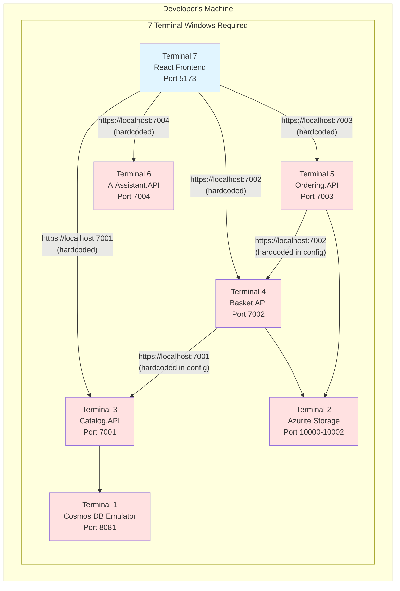
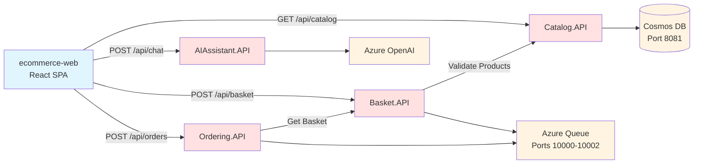

# ECommerce - Start Project

This is a sophisticated brownfield ecommerce application with microservices architecture that you'll migrate to .NET Aspire during the workshop exercises.

## Architecture

The application consists of multiple microservices following modern distributed patterns:

### Microservices

- **Catalog.API** - Product catalog service with Azure Cosmos DB
  - Product management (CRUD operations)
  - Category filtering
  - Product search
  
- **Basket.API** - Shopping basket service with Azure Queue Storage
  - Basket management per buyer
  - Checkout process
  - Integration with Azure Queue for order processing
  
- **Ordering.API** - Order processing service with Azure Queue Storage
  - Order management
  - Order status tracking
  - Event notifications via Azure Queue
  
- **AIAssistant.API** - AI-powered customer assistant with Azure OpenAI
  - Chat-based customer support
  - Product recommendations
  - Order inquiries
  
- **ECommerce.Shared** - Shared models and events
  - Domain models (CatalogItem, Basket, Order)
  - Integration events (OrderPlaced, OrderStatusChanged)

### Frontend

- **ecommerce-web** - React + TypeScript frontend (Vite)
  - Modern SPA with TypeScript
  - Product browsing
  - Shopping cart
  - Order management
  - AI chat assistant

## Current State: The Problems Without Aspire

This is a traditional microservices application **without** .NET Aspire. While functional, it demonstrates the significant challenges of managing microservices manually.

### ⚠️ Current Architecture Challenges



### 🔥 Pain Points You'll Experience

#### 1. **Configuration Hell**
- **18+ hardcoded URLs** across multiple files
- Different configs for dev/staging/production
- Service URLs in: appsettings.json (×3), .env files, TypeScript code
- Port changes require updates in 4+ places

**Example:** Adding Basket → Catalog dependency requires:
1. Edit `Basket.API/appsettings.json` to add Catalog URL
2. Edit `Basket.API/Program.cs` to configure HttpClient
3. Create `CatalogClient.cs` with hardcoded URL logic
4. Update configs for staging and production
5. Document the new dependency for team

#### 2. **Startup Complexity**
- **Manual startup order required:** Infrastructure → Catalog → Basket → Ordering → Frontend
- **7 terminal windows** to manage (see diagram above)
- **5-10 minutes** to start everything
- If you start services in wrong order → cascading failures

#### 3. **Port Conflict Nightmare**
- **Fixed port allocation:** 7001, 7002, 7003, 7004, 5173, 8081, 10000-10002
- **Team conflicts:** Multiple developers can't run the same services simultaneously
- **Resolution:** Manually edit launchSettings.json, update all dependent configs

#### 4. **No Observability**
- **Scattered logs** across 7 different terminal windows
- **No request tracing** across services
- **No performance metrics**
- **Debugging:** "Find the error in 7 different log streams" 😫

#### 5. **Service Discovery Fragility**
```csharp
// Basket.API needs to call Catalog.API
// Current approach: Hardcoded URL from configuration
var catalogUrl = configuration["ServiceUrls:CatalogApi"]; // What if this is wrong?
var client = new HttpClient { BaseAddress = new Uri(catalogUrl) };

// Problems:
// - If Catalog.API changes ports → breaks
// - If URL is wrong → silent failure or cryptic error
// - Different per environment → config drift
// - No automatic retry, circuit breaker, or fallback
```

### 📊 Before vs. After Aspire

| Challenge | **Without Aspire (Current)** | **With Aspire (Exercise 1)** |
|-----------|------------------------------|------------------------------|
| **Service URLs** | 18+ hardcoded entries | Service names (e.g., `https+http://catalog-api`) |
| **Startup** | 7 terminals, manual order, 5-10 min | F5, automatic, 30 seconds |
| **Port Management** | Fixed ports, conflicts common | Dynamic allocation, no conflicts |
| **Observability** | 7 separate log streams | Unified dashboard with tracing |
| **Configuration** | Per-environment appsettings | Centralized in AppHost |
| **Service Discovery** | Manual HttpClient setup | Automatic with `.WithReference()` |
| **Debugging** | Hunt across terminals | Single pane of glass |
| **Team Onboarding** | 50-line setup guide | "Clone and F5" |

### 🎯 What This Workshop Teaches

**Current Reality (This Project):**
```bash
# To run this application, you must:
1. Start Cosmos DB Emulator (wait 2 minutes)
2. Start Azurite storage emulator
3. Start Catalog.API (depends on Cosmos)
4. Start Basket.API (depends on Catalog + Azurite)
5. Start Ordering.API (depends on Basket + Azurite)
6. Start AIAssistant.API (optional)
7. Start React frontend (depends on all APIs)

Total: 7 terminals, ~10 minutes, high chance of errors
```

**With Aspire (After Exercise 1):**
```bash
# To run this application:
1. Press F5

That's it. Everything starts automatically in correct order.
Aspire Dashboard opens showing all services, logs, traces, metrics.
```

### 📚 Deep Dive Documentation

Want to understand exactly what problems Aspire solves?

- **[Service Discovery Challenges](docs/SERVICE-DISCOVERY-CHALLENGES.md)** - Detailed breakdown of manual service discovery problems
- **[Troubleshooting Guide](docs/BEFORE-ASPIRE-TROUBLESHOOTING.md)** - Common errors and how to fix them (spoiler: Aspire fixes them all automatically!)

### 🏗️ Service Dependencies



**Dependency Chain:**
- Frontend depends on all 4 APIs
- Basket.API depends on Catalog.API
- Ordering.API depends on Basket.API
- All APIs depend on Azure resources (Cosmos DB, Storage, OpenAI)

**Manual Management Issues:**
- ❌ Must start in correct order or face cascading failures
- ❌ Each dependency requires manual configuration
- ❌ No automatic health checks
- ❌ No automatic retry or circuit breaker patterns

**After Aspire Migration:**
- ✅ Declare dependencies once in AppHost
- ✅ Automatic orchestration and startup order
- ✅ Built-in health checks
- ✅ Automatic service discovery and resilience

## Azure Services Used

- **Azure Cosmos DB** - NoSQL database for product catalog
- **Azure Queue Storage** - Message queue for async order processing
- **Azure Blob Storage** - Basket persistence (optional)
- **Azure OpenAI / AI Foundry** - AI-powered chat assistant

## Running the Application

### Prerequisites

- .NET 9.0 SDK or later
- Node.js 20+ and npm
- Azure Cosmos DB Emulator or Azure account
- Azure Storage Emulator (Azurite) or Azure account
- Azure OpenAI account (optional, for AI features)
- Your favorite IDE (Visual Studio, VS Code, or Rider)

### Setup Azure Resources

#### Option 1: Local Development (Emulators)

1. **Install Azure Cosmos DB Emulator** (Windows only) or use the Linux container:
```bash
docker run -p 8081:8081 -p 10250-10255:10250-10255 mcr.microsoft.com/cosmosdb/linux/azure-cosmos-emulator
```

2. **Install Azurite** (Azure Storage Emulator):
```bash
npm install -g azurite
azurite --silent --location c:\azurite --debug c:\azurite\debug.log
```

#### Option 2: Azure Cloud Resources

Create Azure resources using Azure CLI:

```bash
# Create resource group
az group create --name aspire-workshop --location eastus

# Create Cosmos DB account
az cosmosdb create --name aspire-workshop-cosmos --resource-group aspire-workshop

# Create Storage account
az storage account create --name aspireworkshopstorage --resource-group aspire-workshop --location eastus

# Create OpenAI resource (optional)
az cognitiveservices account create --name aspire-workshop-openai --resource-group aspire-workshop --kind OpenAI --sku S0 --location eastus
```

### Configuration

Update `appsettings.json` in each service:

**Catalog.API/appsettings.json:**
```json
{
  "CosmosDb": {
    "ConnectionString": "AccountEndpoint=https://localhost:8081/;AccountKey=C2y6yDjf5/R+ob0N8A7Cgv30VRDJIWEHLM+4QDU5DE2nQ9nDuVTqobD4b8mGGyPMbIZnqyMsEcaGQy67XIw/Jw==",
    "DatabaseName": "ECommerceDB",
    "CatalogContainerName": "Catalog"
  }
}
```

**Basket.API/appsettings.json & Ordering.API/appsettings.json:**
```json
{
  "AzureStorage": {
    "ConnectionString": "UseDevelopmentStorage=true"
  }
}
```

**AIAssistant.API/appsettings.json:**
```json
{
  "AzureOpenAI": {
    "Endpoint": "https://your-resource.openai.azure.com/",
    "Key": "your-key-here",
    "DeploymentName": "gpt-4"
  }
}
```

### Running Locally

1. **Start the Catalog API:**
```bash
cd src/Catalog.API
dotnet run
```
The API will start at `https://localhost:7001`

2. **Start the Basket API:**
```bash
cd src/Basket.API
dotnet run
```
The API will start at `https://localhost:7002`

3. **Start the Ordering API:**
```bash
cd src/Ordering.API
dotnet run
```
The API will start at `https://localhost:7003`

4. **Start the AI Assistant API:**
```bash
cd src/AIAssistant.API
dotnet run
```
The API will start at `https://localhost:7004`

5. **Start the React Frontend:**
```bash
cd src/ecommerce-web
npm install
npm run dev
```
The frontend will start at `http://localhost:5173`

### API Endpoints

**Catalog API (Port 7001):**
- `GET /api/catalog` - Get all products
- `GET /api/catalog/{id}` - Get product by ID
- `GET /api/catalog/category/{category}` - Get products by category
- `POST /api/catalog` - Create product
- `PUT /api/catalog/{id}` - Update product
- `DELETE /api/catalog/{id}` - Delete product

**Basket API (Port 7002):**
- `GET /api/basket/{buyerId}` - Get buyer's basket
- `POST /api/basket` - Update basket
- `DELETE /api/basket/{buyerId}` - Delete basket
- `POST /api/basket/{buyerId}/checkout` - Checkout basket

**Ordering API (Port 7003):**
- `GET /api/orders` - Get all orders
- `GET /api/orders/{id}` - Get order by ID
- `POST /api/orders` - Create order
- `PUT /api/orders/{id}/status` - Update order status

**AI Assistant API (Port 7004):**
- `POST /api/chat` - Send chat message
- `DELETE /api/chat/{userId}` - Clear conversation history

### Testing the APIs

You can test the APIs using the built-in OpenAPI (Swagger) interfaces or use curl:

```bash
# Get all products
curl https://localhost:7001/api/catalog

# Get a basket
curl https://localhost:7002/api/basket/user123

# Create an order
curl -X POST https://localhost:7003/api/orders \
  -H "Content-Type: application/json" \
  -d '{"buyerId":"user123","items":[],"total":0}'

# Chat with AI
curl -X POST https://localhost:7004/api/chat \
  -H "Content-Type: application/json" \
  -d '{"userId":"user123","message":"What products do you recommend?"}'
```

## Project Structure

```
src/
├── Catalog.API/              # Product catalog microservice
│   ├── Services/
│   │   └── CatalogService.cs
│   └── Program.cs
├── Basket.API/               # Shopping basket microservice
│   ├── Services/
│   │   └── BasketService.cs
│   └── Program.cs
├── Ordering.API/             # Order processing microservice
│   ├── Services/
│   │   └── OrderingService.cs
│   └── Program.cs
├── AIAssistant.API/          # AI chat assistant microservice
│   ├── Services/
│   │   └── ChatService.cs
│   └── Program.cs
├── ECommerce.Shared/         # Shared library
│   ├── Models/
│   │   ├── CatalogItem.cs
│   │   ├── Basket.cs
│   │   └── Order.cs
│   └── Events/
│       └── OrderEvents.cs
└── ecommerce-web/            # React frontend
    ├── src/
    │   ├── components/
    │   ├── services/
    │   └── App.tsx
    └── package.json
```

## What You'll Learn

Throughout the workshop exercises, you'll:

1. **Exercise 1**: Add Aspire orchestration and create a system topology
   - Add AppHost and ServiceDefaults
   - Configure service discovery
   - Add Azure resource integrations
   - Use the Aspire Dashboard for observability
   
2. **Exercise 2**: Deploy your application using Aspire deployment features
   - Generate deployment manifests
   - Deploy to Azure Container Apps
   - Configure Azure resources through Aspire
   
3. **Exercise 3**: Extend Aspire with custom components
   - Add Redis caching
   - Implement custom health checks
   - Add custom metrics and telemetry
   - Create reusable Aspire components

## Key Differences from Simple Applications

This sophisticated architecture demonstrates:

- **Microservices Pattern**: Multiple independent services
- **Event-Driven Architecture**: Using Azure Queue for async communication
- **Modern Frontend**: React with TypeScript instead of server-rendered Razor
- **Cloud-Native Design**: Azure Cosmos DB, Queue Storage, and OpenAI
- **AI Integration**: Real-world AI assistant feature
- **Scalability**: Each service can scale independently

## Common Issues

### Issue: Cosmos DB connection fails
**Solution**: Ensure the Cosmos DB Emulator is running or use valid Azure Cosmos DB credentials

### Issue: Azure Storage connection fails
**Solution**: Start Azurite: `azurite --silent` or use valid Azure Storage credentials

### Issue: AI Assistant returns configuration error
**Solution**: This is expected if Azure OpenAI is not configured. The feature is optional for the basic workshop

### Issue: Services can't communicate
**Solution**: Ensure all services are running on their designated ports (check launchSettings.json)

## Next Steps

Ready to modernize this application with .NET Aspire? Start with:
- [Exercise 1: Creating a System Topology](../../exercises/01-system-topology/README.md)

Let's transform this brownfield application into a cloud-native, observable, and easy-to-deploy system! 🚀
