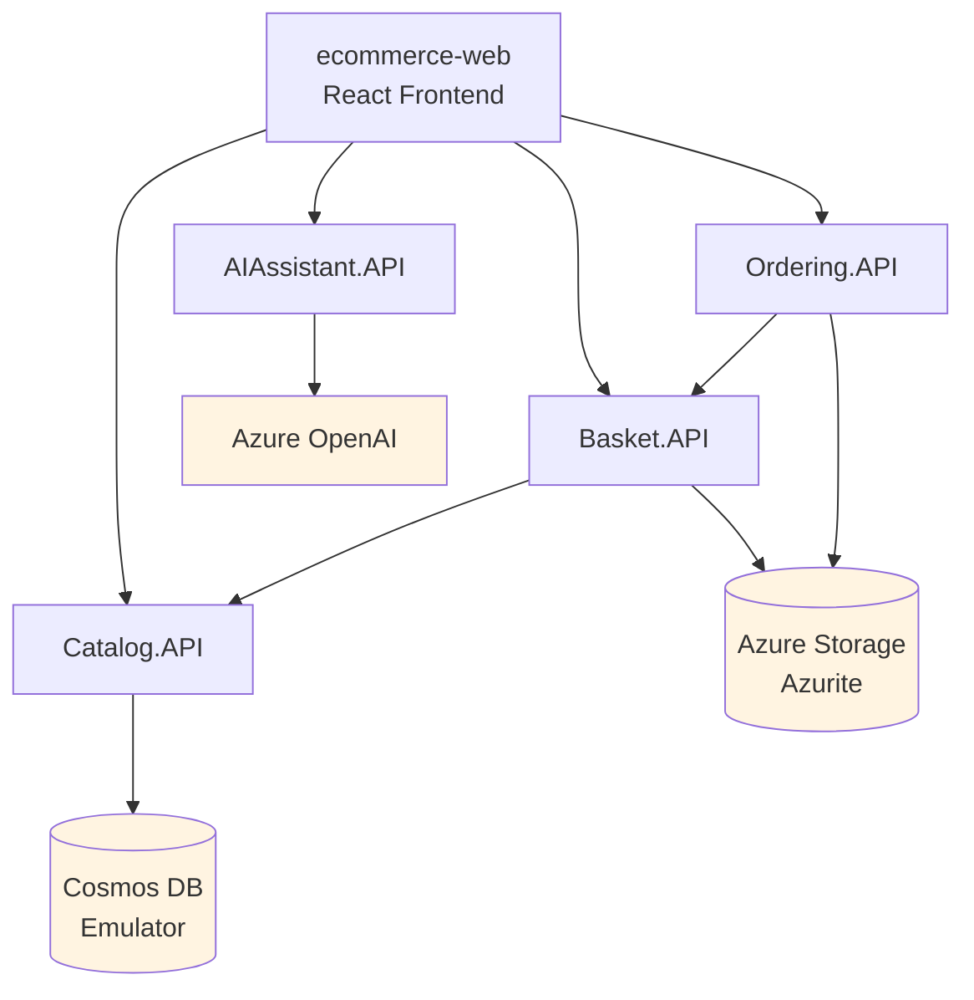

# Scenario: Startup Order Dependencies

## The Problem

Services have dependencies on each other and on infrastructure. Without orchestration, you must manually start everything in the correct order, or face cascading failures.

## The Dependency Graph



## Correct Startup Order

### Level 1: Infrastructure (No Dependencies)
```bash
# Must start FIRST
1. Cosmos DB Emulator
2. Azurite (Storage Emulator)
```

### Level 2: Base Services
```bash
# Can start after infrastructure is ready
3. Catalog.API  (depends on: Cosmos DB)
4. AIAssistant.API (depends on: Azure OpenAI - optional)
```

### Level 3: Dependent Services
```bash
# Can start after Level 2
5. Basket.API  (depends on: Catalog.API + Azurite)
```

### Level 4: Higher-Level Services
```bash
# Can start after Level 3
6. Ordering.API  (depends on: Basket.API + Azurite)
```

### Level 5: Frontend
```bash
# Must start LAST
7. ecommerce-web  (depends on: ALL APIs)
```

## Manual Startup Process (Current State)

### The Full Procedure

#### Terminal 1: Start Cosmos DB
```bash
# Windows with Cosmos DB Emulator installed
# Start from Start Menu, or:
"C:\Program Files\Azure Cosmos DB Emulator\CosmosDB.Emulator.exe"

# Or Docker (all platforms)
docker run -p 8081:8081 -p 10250-10255:10250-10255 \
  --name cosmosdb-emulator \
  mcr.microsoft.com/cosmosdb/linux/azure-cosmos-emulator

# ⏰ WAIT 2-3 MINUTES for emulator to fully initialize
# Check: curl https://localhost:8081/_explorer/index.html
```

#### Terminal 2: Start Azurite
```bash
azurite --silent --location c:\azurite --debug c:\azurite\debug.log

# Or Docker
docker run -p 10000:10000 -p 10001:10001 -p 10002:10002 \
  mcr.microsoft.com/azure-storage/azurite

# ⏰ WAIT 10-15 seconds
# Check: curl http://127.0.0.1:10000/devstoreaccount1?comp=list
```

#### Terminal 3: Start Catalog.API
```bash
cd src/Catalog.API
dotnet run

# ⏰ WAIT for: "Now listening on: https://localhost:7001"
# Takes 5-10 seconds after Cosmos DB is ready
```

#### Terminal 4: Start Basket.API
```bash
cd src/Basket.API
dotnet run

# ⏰ WAIT for: "Now listening on: https://localhost:7002"
# Takes 5-10 seconds
# Attempts to validate products with Catalog.API on startup
```

#### Terminal 5: Start Ordering.API
```bash
cd src/Ordering.API
dotnet run

# ⏰ WAIT for: "Now listening on: https://localhost:7003"
# Takes 5-10 seconds
```

#### Terminal 6: Start AIAssistant.API (Optional)
```bash
cd src/AIAssistant.API
dotnet run

# ⏰ WAIT for: "Now listening on: https://localhost:7004"
# May show config warnings if OpenAI not configured
```

#### Terminal 7: Start Frontend
```bash
cd src/ecommerce-web
npm run dev

# ⏰ WAIT for: "Local: http://localhost:5173"
# Takes 3-5 seconds
```

### Total Startup Time
- **Infrastructure warm-up:** 2-3 minutes
- **Services startup:** 30-50 seconds
- **Total:** **3-4 minutes** (best case, no errors)

### Required Windows/Terminals
- **7 terminal windows** or tabs
- **Or:** Use 7 different IDE instances
- **Or:** Complex batch scripts with careful timing

## What Goes Wrong

### Error 1: Start Services Before Infrastructure

```bash
# ❌ Start Catalog.API before Cosmos DB is ready
cd src/Catalog.API
dotnet run

# Output:
Unhandled exception. Azure.RequestFailedException: 
  A connection attempt failed because the connected party 
  did not properly respond after a period of time...
  
# Service crashes immediately
```

**Fix:** Restart Cosmos DB, wait 2 minutes, restart Catalog.API

**Time lost:** 3-5 minutes

### Error 2: Start Dependent Service Before Dependency

```bash
# ❌ Start Ordering.API before Basket.API
cd src/Ordering.API
dotnet run

# Service starts, but when you try to create an order:
fail: Ordering.API.Services.OrderingService[0]
      Cannot retrieve basket - Basket API unavailable at https://localhost:7002
System.Net.Http.HttpRequestException: Connection refused
```

**Fix:** Start Basket.API, then retry order creation

**Time lost:** 2-3 minutes

### Error 3: Forget to Start a Dependency

```bash
# Start all services EXCEPT Basket.API
# Frontend loads, Catalog works, but checkout fails

# Browser console:
Failed to POST to https://localhost:7002/api/basket/checkout
ERR_CONNECTION_REFUSED
```

**Fix:** Start Basket.API, refresh page, try again

**Time lost:** 1-2 minutes

### Error 4: Wrong Startup Order - Cascading Failures

```bash
# Start in completely wrong order:
# 1. Frontend (Terminal 1)
$ cd src/ecommerce-web && npm run dev
# ⚠️ Starts but can't reach any APIs

# 2. Ordering.API (Terminal 2)
$ cd src/Ordering.API && dotnet run
# ⚠️ Starts but can't reach Basket.API

# 3. Basket.API (Terminal 3)
$ cd src/Basket.API && dotnet run
# ⚠️ Starts but can't reach Catalog.API or Azurite

# 4. Catalog.API (Terminal 4)
$ cd src/Catalog.API && dotnet run
# ❌ CRASHES - Cosmos DB not running

# 5. Now start Cosmos DB (Terminal 5)
$ docker run ...
# ⏰ Wait 2 minutes

# 6. Restart Catalog.API
# 7. Restart Basket.API (depends on Catalog)
# 8. Restart Ordering.API (depends on Basket)
# 9. Refresh Frontend
```

**Time lost:** 10-15 minutes

## Developer Onboarding Impact

### New Developer's First Day

**Typical experience:**

1. **9:00 AM** - Clone repository
2. **9:10 AM** - Read README, install prerequisites
3. **9:30 AM** - Try to run application
4. **9:31 AM** - First service fails (Cosmos DB not running)
5. **9:35 AM** - Start Cosmos DB, wait
6. **9:38 AM** - Retry, different service fails (Azurite not running)
7. **9:42 AM** - Start Azurite
8. **9:45 AM** - Retry, services start in wrong order
9. **9:50 AM** - Ask senior developer for help
10. **10:00 AM** - Senior developer creates startup script
11. **10:15 AM** - Script works but requires specific terminal setup
12. **10:30 AM** - Finally running!

**Time to first successful run:** **90 minutes**

**With Aspire:** Clone, F5, running in **5 minutes**

## Attempted Solutions (Without Aspire)

### Solution 1: Batch Script (Windows)

```batch
@echo off
echo Starting e-commerce application...

echo [1/7] Starting Cosmos DB Emulator...
start "" "C:\Program Files\Azure Cosmos DB Emulator\CosmosDB.Emulator.exe"
timeout /t 120 /nobreak

echo [2/7] Starting Azurite...
start /B azurite --silent
timeout /t 15 /nobreak

echo [3/7] Starting Catalog.API...
start "" cmd /k "cd src\Catalog.API && dotnet run"
timeout /t 10 /nobreak

echo [4/7] Starting Basket.API...
start "" cmd /k "cd src\Basket.API && dotnet run"
timeout /t 10 /nobreak

echo [5/7] Starting Ordering.API...
start "" cmd /k "cd src\Ordering.API && dotnet run"
timeout /t 10 /nobreak

echo [6/7] Starting AIAssistant.API...
start "" cmd /k "cd src\AIAssistant.API && dotnet run"
timeout /t 10 /nobreak

echo [7/7] Starting Frontend...
start "" cmd /k "cd src\ecommerce-web && npm run dev"

echo All services started!
```

**Problems:**
- ❌ Creates 6+ new command windows
- ❌ Fixed delays don't work on slow machines
- ❌ No error handling
- ❌ Can't see aggregated logs
- ❌ Hard to stop all services
- ❌ Windows-only
- ❌ Still takes 3-4 minutes

### Solution 2: Docker Compose

```yaml
version: '3.8'
services:
  cosmosdb:
    image: mcr.microsoft.com/cosmosdb/linux/azure-cosmos-emulator
    ports:
      - "8081:8081"
      - "10250-10255:10250-10255"
  
  azurite:
    image: mcr.microsoft.com/azure-storage/azurite
    ports:
      - "10000:10000"
      - "10001:10001"
      - "10002:10002"
  
  catalog-api:
    build: ./src/Catalog.API
    ports:
      - "7001:8080"
    depends_on:
      - cosmosdb
    # ... more config
```

**Problems:**
- ❌ Requires Dockerizing all .NET services
- ❌ Different config from local development
- ❌ Slower build/startup in containers
- ❌ Frontend still separate (npm run dev)
- ❌ `depends_on` doesn't wait for service readiness
- ❌ No integrated debugging
- ❌ Different setup from production

### Solution 3: Makefiles

```makefile
.PHONY: start-infra start-services start-frontend

start-infra:
	docker run -d -p 8081:8081 cosmosdb-emulator
	azurite --silent &
	sleep 30

start-services: start-infra
	cd src/Catalog.API && dotnet run &
	sleep 10
	cd src/Basket.API && dotnet run &
	sleep 10
	cd src/Ordering.API && dotnet run &
```

**Problems:**
- ❌ Background processes hard to manage
- ❌ No log aggregation
- ❌ Difficult to stop cleanly
- ❌ Sleep timings unreliable
- ❌ Not cross-platform (bash-specific)

## The Aspire Solution

### AppHost Configuration

```csharp
var builder = DistributedApplication.CreateBuilder(args);

// Infrastructure - Aspire starts these first automatically
var cosmos = builder.AddAzureCosmosDB("cosmos").RunAsEmulator();
var storage = builder.AddAzureStorage("storage").RunAsEmulator();
var queues = storage.AddQueues("queues");

// Services - Aspire handles dependency order
var catalogApi = builder.AddProject<Projects.Catalog_API>("catalog-api")
    .WithReference(cosmos);  // Waits for Cosmos DB

var basketApi = builder.AddProject<Projects.Basket_API>("basket-api")
    .WithReference(catalogApi)  // Waits for Catalog.API
    .WithReference(queues);     // Waits for storage

var orderingApi = builder.AddProject<Projects.Ordering_API>("ordering-api")
    .WithReference(basketApi)  // Waits for Basket.API
    .WithReference(queues);

var aiApi = builder.AddProject<Projects.AIAssistant_API>("ai-api");

// Frontend
builder.AddNpmApp("frontend", "../ecommerce-web")
    .WithReference(catalogApi)
    .WithReference(basketApi)
    .WithReference(orderingApi)
    .WithReference(aiApi);

builder.Build().Run();
```

### What Happens

1. **Press F5**
2. Aspire analyzes dependency graph
3. Starts infrastructure first (Cosmos, Azurite)
4. Waits for infrastructure to be healthy
5. Starts Catalog.API
6. Waits for Catalog.API to be healthy
7. Starts Basket.API
8. Waits for Basket.API to be healthy
9. Starts Ordering.API and AI.API (parallel - no dependency between them)
10. Starts Frontend last
11. **Dashboard opens showing everything**

**Total time:** 30-40 seconds  
**Terminal windows:** 1 (just the Aspire dashboard)  
**Manual steps:** 0  
**Error handling:** Automatic

## Comparison

| Aspect | Manual Startup | Batch Script | Docker Compose | **Aspire** |
|--------|---------------|--------------|----------------|------------|
| **Setup time** | 0 min | 30 min | 2 hours | 10 min |
| **Startup time** | 3-4 min | 3-4 min | 2-3 min | **30 sec** |
| **Terminal windows** | 7 | 6+ | 1 | **1** |
| **Error handling** | Manual | None | Limited | **Automatic** |
| **Dependency order** | Manual | Fixed delays | depends_on | **Smart waiting** |
| **Health checks** | None | None | Limited | **Built-in** |
| **Log aggregation** | None | None | docker logs | **Dashboard** |
| **Debugging** | ✅ Easy | ❌ Hard | ❌ Hard | **✅ Easy** |
| **Cross-platform** | ❌ No | ❌ No | ✅ Yes | **✅ Yes** |
| **Production parity** | ✅ High | ❌ Low | ⚠️ Medium | **✅ High** |

## Real-World Impact

### Team of 5 Developers

**Time spent on startup per day:**
- Manual startup: 3-4 minutes
- 2 starts per day average (morning + after lunch)
- = 6-8 minutes per developer per day

**Annual cost:**
- 5 developers × 7 minutes × 250 work days = **8,750 minutes**
- = **146 hours** = **~18 work days**

**With Aspire:**
- F5 once in morning: 30 seconds
- Rarely need to restart
- = **30 seconds per day**

**Annual savings:**
- 5 developers × 250 days × 6.5 minutes saved = **8,125 minutes saved**
- = **135 hours** = **~17 work days**

At $100/hour: **$13,500 saved annually**

Plus:
- ✅ No onboarding friction
- ✅ No "works on my machine" issues
- ✅ Faster debugging with unified logs
- ✅ Better developer experience = better retention

## Try It Yourself

### Experience the Pain

1. Close everything
2. Try to start all 7 components in **random order**
3. Note which fail and why
4. Figure out the correct order
5. Start them all correctly
6. Time the whole process ⏱️

### Experience the Relief

Complete [Exercise 1](../../../exercises/01-system-topology/README.md):

1. Press F5
2. Watch everything start automatically
3. Note the time ⏱️
4. Compare!

## Conclusion

Manual startup order management is a **daily tax** on development velocity:

- **Cognitive load:** Remember the correct order
- **Time sink:** 3-4 minutes per startup
- **Frustration:** "Why isn't this working?" debugging
- **Onboarding friction:** New developers struggle for hours

.NET Aspire **eliminates all of this** with:
- Smart dependency analysis
- Automatic orchestration
- Health-aware startup
- Single F5 to run everything

**Next:** Return to [Service Discovery Challenges](../SERVICE-DISCOVERY-CHALLENGES.md) for the complete picture.